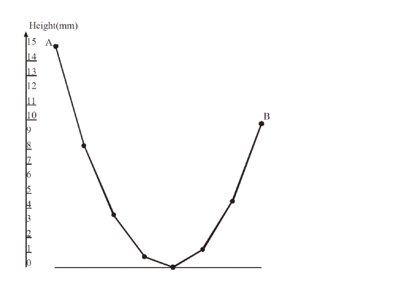

# Гирлянда

Гирлянда состоит из  лампочек на общем проводе.  Один её конец закреплен на заданной высоте  мм ().  Благодаря силе тяжести гирлянда
 прогибается: высота каждой неконцевой лампы на 1 мм меньше, чем средняя высота ближайших соседей ( для ).

Требуется найти минимальную высоту второго конца  () при условии, что лишь одна лампочка может касаться земли, а для остальных выполняется условие .

Подсказка: для решения этой задачи можно использовать двоичный поиск (метод дихотомии).



### Формат входного файла

В первой строке входного файла содержится два числа  и  (,  -- целое, ,  -- вещественное и дано не более чем с тремя знаками после десятичной точки).

### Формат выходного файла

Выведите одно вещественное число  -- минимальную высоту второго конца.  Ваш ответ будет засчитан, если он будет отличаться от правильного не более, чем на .

### Примеры

`input.txt`
```
8 15
```

`output.txt`
```
9.75
```

`input.txt`
```
692 532.81
```

`output.txt`
```
446113.34434782615
```

### Решение

[Garland.scala](Garland.scala)
