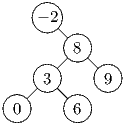

# Высота дерева

Высотой дерева называется максимальное число вершин дерева в цепочке, начинающейся в корне дерева, заканчивающейся в одном из его листьев, и не содержащей никакую вершину дважды.

Так, высота дерева, состоящего из единственной вершины, равна единице.  Высота пустого дерева (да, бывает и такое!) равна нулю.  Высота дерева, изображенного на рисунке, равна четырем.



Дано двоичное дерево поиска.  В вершинах этого дерева записаны ключи -- целые числа, по модулю не превышающие .  Для каждой вершины дерева  выполняется следующее условие:

- все ключи вершин из левого поддерева меньше ключа вершины ;
- все ключи вершин из правого поддерева больше ключа вершины .

Найдите высоту данного дерева.

### Формат входного файла

Входной файл содержит описание двоичного дерева.  В первой строке файла находится число  () -- число вершин в дереве.  В последующих  строках файла находятся описания вершин дерева.  В )-ой строке файла () находится описание -ой вершины, состоящее из трех чисел , , , разделенных пробелами -- ключа в -ой вершине (), номера левого ребенка -ой вершины ( или , если левого ребенка нет) и номера правого ребенка -ой вершины ( или , если правого ребенка нет).

Все ключи различны.  Гарантируется, что данное дерево является деревом поиска.

### Формат выходного файла

Выведите одно целое число -- высоту дерева.

### Пример

`input.txt`
```
6
-2 0 2
8 4 3
9 0 0
3 6 5
6 0 0
0 0 0
```

`output.txt`
```
4
```

### Решение

[TreeHeight.scala](TreeHeight.scala)
