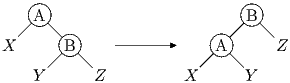
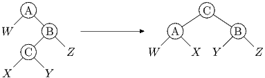

# Делаю я левый поворот...

Для балансировки АВЛ-дерева при операциях вставки и удаления производятся *левые* и *правые* повороты.  Левый поворот в вершине производится, когда баланс этой вершины больше 1, аналогично, правый поворот производится при балансе, меньшем −1.

Существует два разных левых (как, разумеется, и правых) поворота: /большой/ и /малый/ левый поворот.

Малый левый поворот осуществляется следующим образом:



 Заметим, что если до выполнения малого левого поворота был нарушен баланс только корня дерева, то после его выполнения все вершины становятся сбалансированными, за исключением случая, когда у правого ребенка корня баланс до поворота равен −1.  В этом случае вместо малого левого поворота выполняется большой левый поворот, который осуществляется так:



Дано дерево, в котором баланс корня равен 2.  Сделайте левый поворот.

### Формат входного файла

Входной файл содержит описание двоичного дерева.  В первой строке файла находится число  () -- число вершин в дереве.  В последующих  строках файла находятся описания вершин дерева.  В )-ой строке файла () находится описание -ой вершины, состоящее из трех чисел , , , разделенных пробелами -- ключа в -ой вершине (), номера левого ребенка -ой вершины ( или , если левого ребенка нет) и номера правого ребенка -ой вершины ( или , если правого ребенка нет).

Все ключи различны.  Гарантируется, что данное дерево является деревом поиска.  Баланс корня дерева (вершины с номером 1) равен 2, баланс всех остальных вершин находится в пределах от -1 до 1.

### Формат выходного файла

Выведите в том же формате дерево после осуществления левого поворота.  Нумерация вершин может быть произвольной при условии соблюдения формата.  Так, номер вершины должен быть меньше номера ее детей.

### Пример

`input.txt`
```
7
-2 7 2
8 4 3
9 0 0
3 6 5
6 0 0
0 0 0
-7 0 0
```

`output.txt`
```
7
3 2 3
-2 4 5
8 6 7
-7 0 0
0 0 0
6 0 0
9 0 0
```

### Решение

[LeftRotation.scala](LeftRotation.scala)
